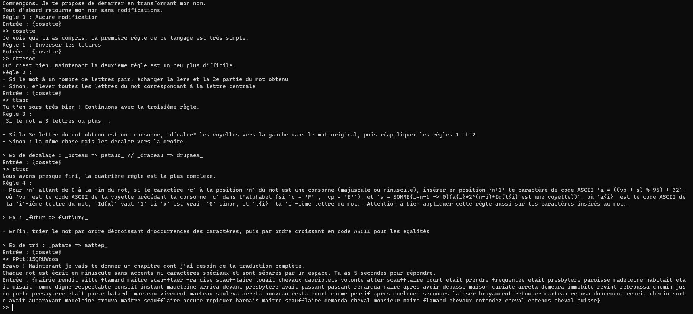

# Des mots, des mots, des mots

**Catégorie** : Difficile | **Points** : 731 | **Solves** : 204

## Description

*Prenant du bon temps à votre table en lisant un livre, vous buvez une gorgée de café. En baissant votre tasse, vous remarquez à travers la fenêtre une petite silhouette, elle semble chercher quelque chose ou quelqu'un.*

*Cette intrigante situation vous pousse à aller à sa rencontre. La silhouette est en réalité une jeune fille rousse. Vos regards se croisent, elle a l'air perdue. Vous la rejoignez, et lui demandez :*

*« Bonjour, puis-je t'aider ?*

*— Oui. Je cherche à traduire un texte selon des règles étranges mot à mot. Il s'agit d'un livre nommé Les Misérables. Peux-tu m'aider ? Au fait, moi c'est Cosette !*

*— Je vois, aucun problème. Je peux justement te faire **un script qui va transformer chaque mot de ton texte**. Quelles sont ces règles ?*

*— Je vais tout t'expliquer, allons nous installer à l'intérieur.»*

*Elle vous suit à votre table et vous vous mettez au travail.*

*Indications :*

- *Les voyelles sont {a, e, i, o, u, y}.*
- *L'indiçage commence à 0.*
- *Les règles sont données en Markdown. Les _ dans les exemples sont des balises italique Markdown et ne comptent pas dans l'exemple.*
- *Les règles sont à appliquer les une après les autres. Typiquement pour la règle 2 il faut partir du résultat de la règle 1, et ainsi de suite.*
- *Le symbole ^ correspond à l'opérateur puissance.*

*nc challenges.404ctf.fr 30980*

## Solution

Pour commencer, je me rends sur l'adresse netcat pour avoir l'énoncé du challenge :

<p align="center">
  
</p>

Pour résoudre le challenge, il n'y a pas de secret, il faut scripter les règles données. J'ai donc réalisé le programme suivant :

```py
from pwn import *


def regle1(s):
    return s[::-1]


def regle2(s):
    if len(s) % 2 == 0:
        return s[-len(s)//2:] + s[:len(s)//2]
    else:
        l = s[len(s)//2]
        return ''.join([i for i in s if i != l])


def regle3(s, orig):
    if len(s) >= 3:
        vowels = "aeiouy"
        vowel_indices = [i for i in range(len(orig)) if orig[i] in vowels]
        if s[2] in vowels:
            shifted_vowel_indices = vowel_indices[1:] + [vowel_indices[0]]
        else:
            shifted_vowel_indices = [vowel_indices[-1]] + vowel_indices[:-1]
        new = ""
        for i in range(len(orig)):
            if i in shifted_vowel_indices:
                new += orig[vowel_indices[shifted_vowel_indices.index(i)]]
            else:
                new += orig[i]
        return regle2(regle1(new))
    else:
        return s


def regle4(s):
    vowels = "aeiouyAEIOUY"
    alpha = "abcdefghijklmnopqrstuvwxyzABCDEFGHIJKLMNOPQRSTUVWXYZ"
    n = 0
    while n != len(s):
        if s[n] not in vowels:
            vp_l = s[n]
            if vp_l in alpha:
                while vp_l not in vowels:
                    vp_l = alpha[alpha.index(vp_l) - 1]
                vp = ord(vp_l)
                somme = 0
                for i in range(n - 1, -1, -1):
                    u = 1 if s[i] in vowels else 0
                    somme += ord(s[i]) * 2 ** (n - i) * u
                s = s[:n + 1] + chr(((vp + somme) % 95) + 32) + s[n + 1:]
        n += 1
    return ''.join(sorted(s, key=lambda x: (-s.count(x), x)))

r = remote("challenges.404ctf.fr", 30980)
r.recvuntil(b">>")

r.sendline(("cosette").encode("utf-8"))
r.recvuntil(b">>")
r.sendline(("ettesoc").encode("utf-8"))
r.recvuntil(b">>")
r.sendline(("ttsoc").encode("utf-8"))
r.recvuntil(b">>")
r.sendline(("ottsc").encode("utf-8"))
r.recvuntil(b">>")
r.sendline(("PPtt!15QRUWcos").encode("utf-8"))

print(r.recvline().decode("utf-8"))
print(r.recvline().decode("utf-8"))
ret = (r.recvline().decode("utf-8")).split()[2:]
answer = []

for i in range(len(ret)) :
    mot = ret[i].replace("{", "").replace("}", "")
    answer.append(regle4(regle3(regle2(regle1(mot)), mot)))
r.sendline(" ".join(answer).encode("utf-8"))
print(ret)
print()
print(" ".join(answer))
print()

print(r.recvline().decode("utf-8"))
print(r.recvline().decode("utf-8"))
print(r.recvline().decode("utf-8"))
print(r.recvline().decode("utf-8"))


r.close()
```

Ce programme est loin d'être parfait et il est évidemment possible de l'améliorer, mais il fonctionne et c'est le principal lorsque l'on est contraint par le temps pendant un CTF. J'ai donc préféré laissé mon script tel quel pour le write-up afin de montrer à quoi ressemble le genre de solution que je peux proposer lors d'un CTF sans réfléchir à l'optimisation.

## Flag

<details>
<summary>🚩</summary>

```
404CTF{:T]cdeikm_)W_doprsu_nt_;adei}
```