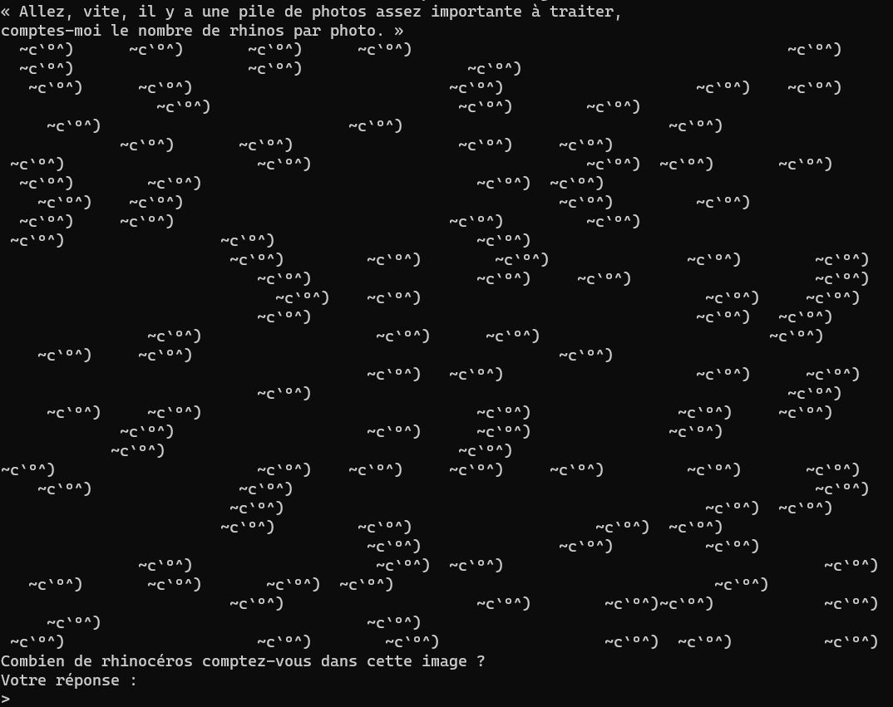

# L'Inondation

**Catégorie** : Introduction | **Points** : 100 | **Solves** : 511

## Description

*Vous prenez une collation accolé au bar du Procope, et remarquez au bout d'une dizaine de minutes un post-it, sur lequel votre nom est écrit, et en dessous une inscription : « Salut, le nouveau, viens à ma rencontre, porte de derrière ».*

*Curieux, vous sortez du café par cette porte et tombez nez à nez avec un jeune homme.*

*« Bonjour, pouquoi ce post-it ?*

*— Salut ! Excellente question. Dernièrement, un évènement étrange a bouleversé ma ville : elle a été prise d'une épidémie de gens se transformant en rhinocéros. Alors que ce n'était jusqu'hier qu'une dizaine de gens qui étaient touchés, j'ai vu ce matin un troupeau de ce qui semblait être plusieurs centaines de rhinocéros passer sous ma fenêtre. J'ai aussitôt saisi mon appareil photo et photographié régulièrement le troupeau pour avoir une estimation du nombre de rhinocéros, mais il y en a bien trop pour compter tout ça à moi seul ou même à deux.*

*— Certes, et où voulez-vous donc en venir ?*

*— Voyez-vous, j'ai entendu parler de vos talent dans les nouvelles technologies par le biais d'un ami qui fréquente ce café. J'imagine qu'un ordinateur saura compter bien plus vite que nous deux, ça vous dirait de m'aider ? D'ailleurs, on ne s'est toujours pas présentés. Moi, c'est Béranger. »*

*nc challenges.404ctf.fr 31420*

## Solution

Pour commencer, je me rends sur l'adresse netcat pour avoir l'énoncé du challenge :

<p align="center">
  
</p>

Il faut donc compter le nombre d'occurrences de la suite de caractères ``~c`°^)``, renvoyer la réponse et répéter l'opération jusqu'à obtenir le flag.

Je fais donc un script pour résoudre le problème :

```py
from pwn import *

r = remote("challenges.404ctf.fr", 31420)
r.recvuntil(b"comptes-moi")

while True:
    try :
        s = ""

        while "Votre" not in s:
            answer = r.recvline().decode("utf-8")
            s += answer
            print(answer)

        r.sendline((str(s.count("~c"))).encode("utf-8"))
        answer = r.recvline().decode("utf-8")
        print(answer)
    except:
        break

r.close()
```

## Flag

<details>
<summary>🚩</summary>

```
404CTF{4h,_l3s_P0uvo1rs_d3_l'iNforM4tiqu3!}
```