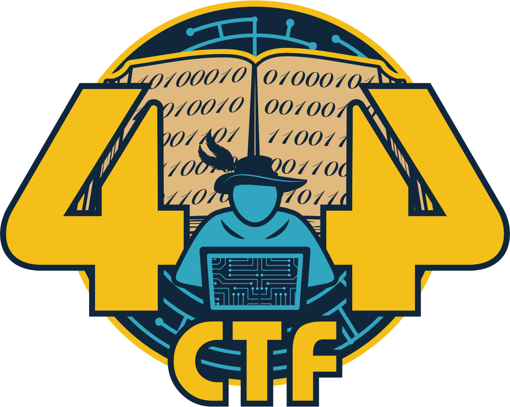

  

<h1 align="center">404CTF 2023</h1>

  Ceci est la deuxième édition du 404CTF, organisé par HackademINT, le club de cybersécurité de Télécom SudParis.

  Vous pouvez retrouver ici des writeups des challenges de cette édition.

