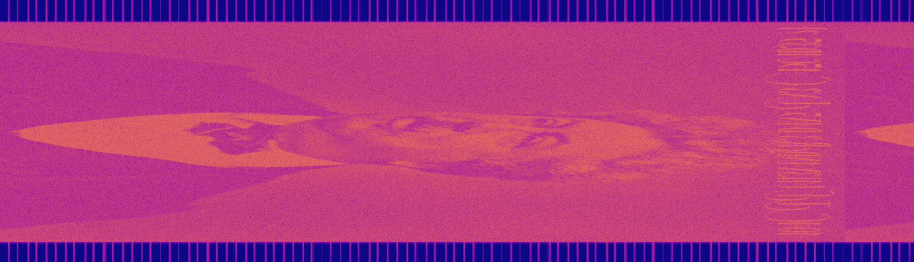

# Avez-vous vu les cascades du hérisson ?

**Catégorie** : Facile | **Points** : 856 | **Solves** : 150

## Description

*Après avoir rencontré Simone, cette dernière vous propose de découvrir une nouvelle personne. Quoi de mieux qu’un cache-cache pour apprendre à mieux se connaître ? Cela vous changera de l'air du café littéraire Le Procope.*

*Vous arrivez dans un lieu qui lui est cher, un lieu d’enfance rempli de souvenirs. C’est ici qu’elle passait ces vacances d’Été, dans le parc de Meyrignac, fondé en 1880 par son grand père Ernest BERTRAND DE BEAUVOIR.*

*Lors de votre partie, non loin de là, vous parvenez habilement à trouver Simone, cependant le troisième joueur demeure parfaitement introuvable. Votre cerveau titanesque a eu la bonne idée de faire ce jeu dehors, en pleine nature, pour plus de difficulté. Sublime. Vous voilà errant au milieu de nulle part. Toutefois, un bruit vous attire :*

*« SPLASHHHH... SHHHHH... SPLASHHHH... SHHHHH... » (Le son d'une cascade d'eau qui tombe et qui ruisselle)*

*Cette chute d'eau paraît ordinaire et suspicieuse. Peut-être parviendrez-vous à trouver ce charmant flibustier à travers les cascades du Hérisson avant qu'il soit l'heure de rentrer au Procope ?*

*Vous avez un oeil de lynx, ainsi vous apercevez que la chute d'eau s'écoule à une fréquence de 2 MHz*

## Solution

Pour résoudre ce challenge, j'ai utilisé mon tool de radio-fréquences préféré : [Universal Radio Hacker](https://github.com/jopohl/urh). J'ai simplement eu à importer le fichier et à visualiser le spectrogramme :

<p align="center">
  
</p>

## Flag

<details>
<summary>🚩</summary>

```
404CTF{413x4ndr3_d4n5_un3_c45c4d35_?}
```