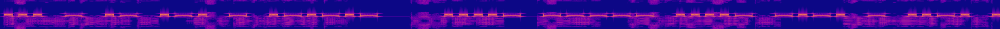

# Ballistic Missile Submarine

**Catégorie** : Moyen | **Points** : 964 | **Solves** : 76

## Description

*Un regard vers la fenêtre vitreuse et couverte d'une fine pellicule de saleté : toujours autant d'eau tombe du ciel. Un souvenir vous revient : votre séjour en Normandie, à musarder sur les plages du débarquement. En mentionnant ce souvenir dans un léger, tenace, et non sans discrétion soupir, vous percevez de votre œil vif la teinte rougissante de Simone de Beauvoir s'instaurer sur sa joue. Effectivement, par le passé elle fut sujette à des problèmes durant la deuxième guerre mondiale, par sa liaison avec [Bianca Bienenfeld](https://fr.wikipedia.org/wiki/Bianca_Lamblin), fille d'un juif polonnais.*

*Les souvenirs de la Seconde Guerre, les navires de guerre, les sous-marrins... Votre esprit entourloupé par cette période ne remarque point l'arrivé d'un certain Paul Verlaine. En se posant avec une tasse d'eau à la main, il vous questionne sur votre torpeur. Aux souvenirs anciens, il vous livre un poème. A la lecture de la première ligne, plus aucun doute : elle fut récitée pour prévenir les résistants de l'organisation du débarquement, à travers la radio, avec l'émission Radio Londres.*

*Par le hasard le plus fortuit, ou bien parce que l'histoire se déroule précisément selon la volonté de l'auteur, votre oreille se dresse telle le loup chassant sa proie. Votre ouïe devient aussi aiguisé qu'un couteau qu'utiliserait un boucher pour découper votre viande du dimanche matin.*

*A la radio, le morceau de musique touche à sa fin. Vient ensuite les premières notes de la 5ème symphonie de Beethoven, mais s'arrête brusquement, laissant place à une voix :*

*« Les Français parlent aux Français. Veuillez écouter d’abord quelques messages personnels. »*

*Pour mieux entendre, vous sortez votre antenne et mettez votre casque. Votre sang se glace...*

*Mettez un casque, réglez la fréquence à 192 kHz*


## Solution

Comme à mon habitude, j'ai simplement ouvert le fichier dans [Universal Radio Hacker](https://github.com/jopohl/urh) et laissé la magie opérer. Je n'ai plus qu'à visualiser le spectrogramme :

<p align="center">
  
</p>

En zoomant, je reconnais tout de suite du morse :

<p align="center">
  
</p>

Ce qui donne :

```
... - .- .-. - .-.-.- ....- ----- ....- -.-. - ..-. .-.-.- .- -.-. -.-. --- .-.. .- -.. . .-.-.- .--. ....- ..- .-.. ..--.- ...- ...-- .-. .---- ....- .. -. ...-- ..--.- ...-- ..... - ..--.- ..- -. ..--.- -- ----- .-. ..... ...-- ..--.- ..--.. .-.-.- .- -.-. -.-. --- .-.. .- -.. . .-.-.- . -. -.. 
```	

Que l'on déchiffre :

```
START.404CTF.ACCOLADE.P4UL_V3R14IN3_35T_UN_M0R53_?.ACCOLADE.END
```

## Flag

<details>
<summary>🚩</summary>

```
404CTF{P4UL_V3R14IN3_35T_UN_M0R53_?}
```