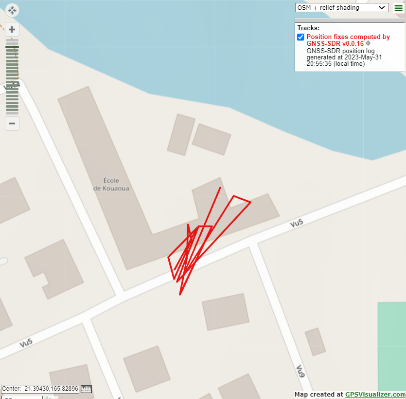

# Gestionnaire de perruche de Sparrman

**Catégorie** : Difficile | **Points** : 1000 | **Solves** : 13

## Description

*Le tonnerre continue de gronder farouchement dehors. Les ondes sonores des gouttes de pluie s'écrasant à l'extérieur stimulent vos oreilles délicates. La soif vous empare.*

*Heureusement, vos synapses au sein de votre gigantesque cerveau sont très réactives : d'un geste vif, vous interpellez le personnel afin d'acquérir une boisson revigorante, en espérant revoir Simone.*

*L'histoire n'aurait évidemment pas lieu si elle n'était pas entre les murs formant Le Procope, c'est pour cela qu'à votre plus grande joie, vous voilà face à face avec madame DE BEAUVOIR. Hélas, celle-ci semble inquiète. Vous le savez si bien dorénavant, celle-ci partage un amour poignant avec le grand Jean-Paul SAT, et ce dernier semble impliqué dans une certaine association.*

*L'idée est simple, et par sa simplicité, elle devient difficile. Alexandre DUMAS, par sa taille, son charisme, et son génie, viendra donc sous peu pour mettre au point la finalité d'un plan afin de voler des données confidentielles.*

*Pour l'heure, Simone a pu trouver une perruche, mais pas n'importe laquelle ! Une perruche de Sparrman. La particularité de ce Cyanoramphus novaezelandiae est qu'il est particulièrement familier, il est donc parfait pour suivre cet incorruptible corrupteur qu'est Jean-Paul SAT, ainsi que les personnes qu'ils fréquentent.*

*Pendant cette harangue, le sommeil vous gagne. À votre réveil, vous entendez les dernières paroles : « ... seulement 8 millions d'échantillonnages par seconde ! Du génie n'est-ce pas ? Pas la peine de m'applaudir, vous allez me faire rougir ! Bon par contre du fait de la taille de l'animal, du pelage inexistant, de son plumage, du ramage qui s'en rapporte, le signal sera sûrement de mauvaise qualité. Mais vous avez des talents, j'en suis certaine. Oh, et voilà Alexandre qui arrive bientôt. Dernière précision : c'est du 8 bits, en complexe. Bonne chance ! »*

*Elle se lève pour étreindre son honneur décoré Chevalier de la Légion d'honneur, qui n'est autre que ce très cher Alexandre DUMAS.*

*Vous voilà dans un état de disgrâce. Une mission de taille, très technique, et aucune information, car vous avez le sommeil facile. Vous prenez votre décaième café, et sortant votre ordinateur personnel dont le poids et la taille permettent un transport facile notamment en extérieur, vous vous lancez dans ce laborieux travail en quête d'un lieu où se trouverait le terminus du long et périlleux voyage de notre perruche de Sparrman.*

## Solution

Pour résoudre ce challenge, je me suis d'abord demandé ce que pouvait être le fichier qui nous été donné. Comme pour ``Sous son trépas victorieux``, en lisant le titre du challenge : de ``Gestionnaire de perruche de Sparrman`` on peut extraire ``GPS`` en gardant les initiales du titre.

J'ai ensuite trouvé un [write-up](https://gnss-sdr.org/my-first-fix/) qui faisait exactement ce dont j'avais besoin. J'ai donc suivi les instructions et utilisé GNSS-SDR en modifiant :

``SignalSource.sampling_frequency=4000000`` par ``SignalSource.sampling_frequency=8000000``, comme dit dans l'énoncé.

J'ai ensuite lancé le script plusieurs fois pour que cela marche. J'ai récupéré en sortie un fichier ``.gpx`` que j'ai ensuite visualisé avec un [tool](https://www.gpsvisualizer.com/) en ligne.

<p align="center">
  
</p>

## Flag

<details>
<summary>🚩</summary>

```
404CTF{ecole_de_kouaoua}
```