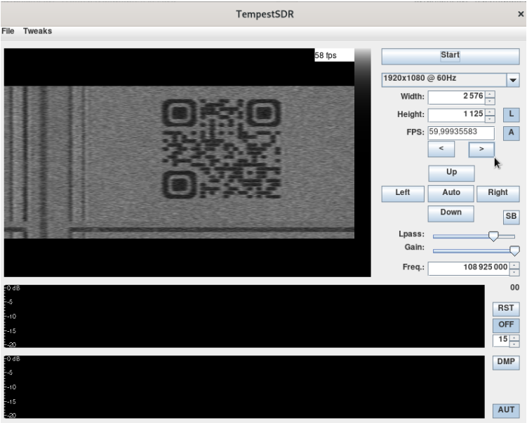

# Le Plombier du câble

**Catégorie** : Moyen | **Points** : 987 | **Solves** : 47

## Description

*Nous y voilà. Il est encore tôt dans la matinée du 3e martis du mois Kankin. À votre table en bois d'acajou, vous retrouvez vos resplendissants compagnons Alexandre et Simone. Vous entendez la fin du récit de monsieur DUMAS sur la dernière pièce de théâtre à laquelle il a pu assister. Ce dernier développe en effet un amour tout particulier pour le théâtre depuis ces jeunes années, où il écrivit un drame historique : [Henri III et sa cour](https://fr.wikipedia.org/wiki/Henri_III_et_sa_cour).*

*Le temps, à l'image d'un sablier, s'écoule tranquillement.*

*Notre trio, autour de leur quatrième pause café de la douce matinée, ont l'air bien nerveux, mais toutefois portent un air rempli de fourberie. Ils ont enfin eu l'éclair de génie pour espionner l'infâme collègue : un plan aux aspects loufoque, mais qui attire vivement votre attention.*

*Simone DE BEAUVOIR est une figure d'intelligence. Son père lui disait qu'elle aurait pu faire Polytechnique si elle était un homme.*

*Elle vous explique le détail de l'affaire : pénétrer dans la plus grande légalité chez notre victime, déployer une antenne et écouter. Mais vu votre talent pour le moins inexistant en matière de discrétion, votre mission sera juste de traiter le signal une fois acquis.*

*C'est ainsi, durant cette journée dont le temps ne se manifeste guerre au beau, dans ce petit café coquet où se situe notre énergumène, situé rue de l'ancienne comédie, dans une petite ville de France, d'une superficie de 105.40 hectares, que nos deux héroïques figures représentant le combat contre la mesquinerie, Alexandre et Simone, déployèrent leur antenne directive de 10 cm, dans l'objectif d'intercepter les communications afin que VOUS les traitiez pour découvrir la sombre, tenace et inéluctable vérité.*


## Solution

Ayant déjà réalisé un challenge similaire, je connaissais déjà le principe. Il faut importer le fichier dans un logiciel bien précis : [TempestSDR](https://github.com/martinmarinov/TempestSDR).

Le plus dur étant de trouver les bons paramètres pour décoder le signal, nous n'avons pas à nous eninquiéter ici car toutes les informations sont données dans le fichier ``.pdf`` mis à disposition.

<p align="center">
  
</p>

On obtenait ainsi un QR code. Il ne restait plus qu'à le scanner pour obtenir le flag.

## Flag

<details>
<summary>🚩</summary>

```
404CTF{4rR3tE_De_m_e$pi0Nn3R}
```