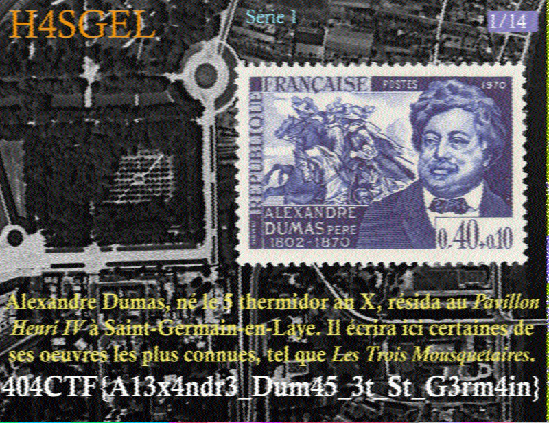

# Sous son trépas victorieux

**Catégorie** : Moyen | **Points** : 997 | **Solves** : 23

## Description

*Votre cœur empli de joie après avoir fait connaissance avec ce cher Alexandre DUMAS, vous voilà de retour dans ce lieu envoûtant en compagnie de ce dernier et de Simone DE BEAUVOIR.*

*Autour de votre dose de cafféine tant attendue, les questions se bousculent dans votre esprit. Mais ce cher Alexandre vous devance : sortant de sa poche une clé USB, il clame que la vérité se trouve en son for intérieur.*

*Pendant que vous scrutez la merveille, ce dernier semble plonger dans ses souvenirs. Vous l'entendez murmurer en levant les yeux au ciel :*

*« Un jour, sous son trépas victorieux, je finirai ... »*

*De plus en plus étrange...*

*En scrutant attentivement ce support de stockage amovible inventé dans les années 2000, vous remarquez qu'il contient un dossier nommé **H4SGEL_S1**.*

*Pris au dépourvu, vous vous mettez à chercher ce que votre très cher compagnon cache.*


## Solution

La difficulté de ce challenge était d'identifier le type de données auxquelles nous avions affaire. En effet, j'ai fais beaucoup de recherches en rapport avec le mot ``sigmf`` mais aucun des outils que j'ai utilisé n'a fonctionné. C'est alors que je me suis rappelé une règle très importante en CTF : si l'on n'arrive pas à identifier le type de fichier et si la description ne nous aide pas, alors l'information cachée est dans le titre. Et en effet, ce fut le cas : en prenant les initiales de ``Sous son trépas victorieux`` on obtient le mot ``SSTV``.

Le SSTV (Slow Scan Television) est une technique utilisée pour transmettre des images via des signaux radio. Il fonctionne en divisant une image en lignes horizontales, puis en envoyant chaque ligne séquentiellement à travers une transmission radio. Les récepteurs SSTV reçoivent ces signaux et les reconstruisent pour afficher l'image complète. Cela permet de transmettre des images à travers de longues distances en utilisant des équipements radio relativement simples. Le SSTV est souvent utilisé par les radioamateurs et les passionnés de communication radio pour partager des images avec d'autres personnes à travers le monde.

En me renseignant donc sur le [SSTV](https://www.sigidwiki.com/wiki/Slow-Scan_Television_(SSTV)), j'ai découvert un outil : [qsstv](https://doc.ubuntu-fr.org/qsstv). J'ai donc installé ce dernier et, après avoir démodulé le signal dans [URH](https://github.com/jopohl/urh), j'ai importé le fichier dans qsstv et laissé la magie opérer.

<p align="center">
  
</p>

## Notes

Il faut importer le fichier ``.sigmf-data`` dans URH, le démoduler (changer ``Analog`` pour ``Demodulated``), puis faire un clic droit sur le graphique et cliquer sur ``Export demodulated`` pour obtenir le .wav en sortie. Bien faire attention à mettre les fichiers ``.sigmf-data`` et ``.sigmf-meta`` dans le même dossier avant de l'importer dans URH.

Ensuite, il faut aller dans qsstv, dans configuration il faut changer le paramètres du sampling si besoin en fonction des informations donées dans le fichier ``.sigmf-meta``, et enfin cliquer sur l'option ``From file``.

Il ne reste plus qu'à revenir sur la page d'accueil, appuyer sur play et importer son fichier ``.wav``.

## Flag

<details>
<summary>🚩</summary>

```
404CTF{A13x4ndr3_Dum45_3t_St_G3rm4in}
```