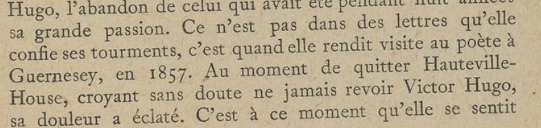

# L'âme d'un poète et le coeur d'une femme 4/4

**Catégorie** : Moyen | **Points** : 919 | **Solves** : 113

## Description

*« Je vous remercie pour l'invitation ! Avez-vous pu vous en procurer une ? J'ai entendu dire que Mme Colet tenait ce salon pour permettre à des personnes talentueuse de se rencontrer. Je suis sûre qu'elle sera ravie de faire votre connaissance, vos talents ne sont plus à démontrer. Peut-être qu'en répondant à ses questions, vous pourrez obtenir un cadeau de sa part ? »*

*Obtenir un cadeau de la part de Louise Colet*

## Solution

Maintenant que nous avons récupéré le lien du serveur Discord, on se rend dessus. Arrivé dessus, un message nous indique : *Nous vous attendions... Mme Colet se trouve actuellement dans le petit salon. Tapez 'le_petit_salon' pour la rejoindre.* On tape donc la commande et cela nous nous donne accès à un nouveau salon.

Arrivé dans le salon *le-petit-salon*, un message de Louise Colet nous dit :

*Bonjour , savez vous en quelle année un promeneur inoccupé qui, sortant du jardin des Tuileries, se serait dirigé sous les arcades de la rue de Rivoli, aurait pu apercevoir sous la porte cochère d'un des plus beaux hôtels du quartier, un grand vieillard à la chevelure et à la moustache blanches ?*

Il faut envoyer un message avec la réponse à la question sous forme d'une année (AAAA). Le principe consiste à envoyer nos propositions dans le fil de discussion et notre message disparaît aussitôt. Si la réponse est bonne, on accède à un nouveau salon. Cependant, ce fonctionnement a deux limites. En effet, le premier est que, aussi rapide soit la disparition du message, elle n'est pas instantanée et on peut donc voir les messages des autres de temps en temps. Le second est que des plugins Discord permettent de voir ces messages car ils ne sont en réalité pas supprimés mais cachés.

Pour cette première partie du challenge, j'ai donc malencontreusement vu la réponse d'un autre joueur et je l'ai rentré (il me semble que c'était une année entre 1840 et 1850). J'accède donc à la deuxième partie du challenge, avec un nouvel énoncé :

*Complétez la suite du poème :*

*Laisse à l'homme la gloire,*

*Les triomphes, le bruit,*

*Format : pas de retour à la ligne, majuscule au début des vers, laisser les espaces et la ponctuation*

Pour résoudre celui-ci j'ai donc fais ma recherche à l'aide d'une dork Google : ``"Laisse à l'homme la gloire," "Les triomphes, le bruit,"``. Le premier [résultat](https://www.persee.fr/doc/grif_0770-6081_1975_num_7_1_1458) me donne donc la suite du poème : *Pour nous, aimer et croire Au bonheur nous conduit.*

Nous accédons donc au troisième salon, avec un nouvel énoncé :

*Où et quand ai-je rendu visite à Mon ami Victor Hugo pour la première fois ?*

*Format : Paris_2002*

Nous devons maintenant trouver le lieu et la date de rencontre entre Louise Colet et Victor Hugo. Pour cela, j'ai à nouveau utilisé une dork Google : ``"Louise" "Colet" "Victor" "Hugo" "rencontre"`` (de mémoire car j'ai sûrement du changer des choses). Je suis tombé sur un [livre](https://gallica.bnf.fr/ark:/12148/bpt6k8572147/f9.item) qui mentionnait exactement ce que je cherchais :

<p align="center">
  
</p>

J'envoie donc comme message : ``Guernesey_1857`` et j'accède au dernier salon, contenant le flag.

## Flag

<details>
<summary>🚩</summary>

```
404CTF{j3_su1s_ravie_d_av0ir_fait_v0tre_connaiss4nce}
```