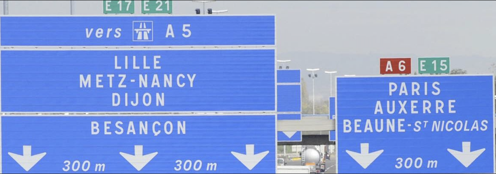
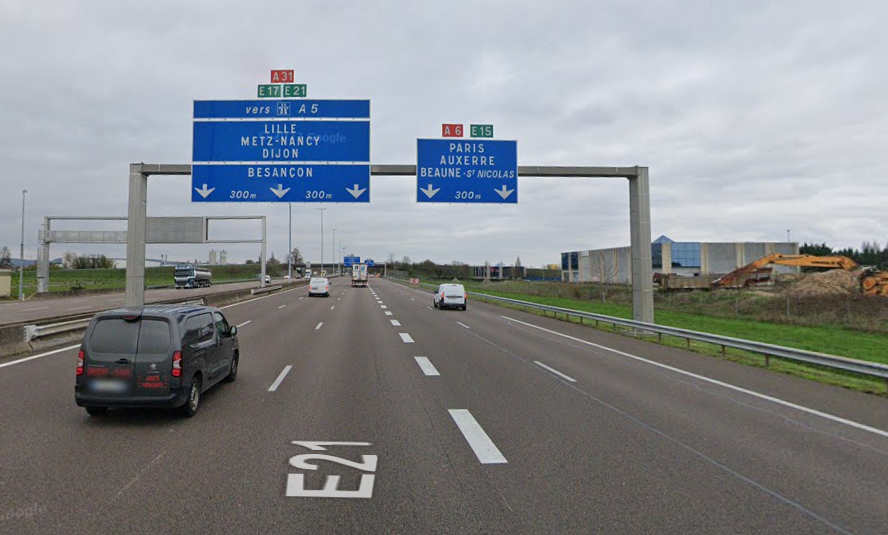

# Le Tour de France

**Catégorie** : Introduction | **Points** : 100 | **Solves** : 1062

## Description

*En flânant entre les tables du Procope, vous entendez une voix qui vous est familière. C'est Phileas Fogg qui s'est mis en tête de faire le tour du monde en 80 jours et il cherche des acolytes pour son voyage.*

*Évidemment, il ne veut pas prendre le premier venu et a mis en place une épreuve d'entrée pour vérifier que vous savez vous retrouver grâce aux outils à disposition. Le rejoindre ne pourrait être qu'une expérience enrichissante pour vous, ce gentleman a beaucoup à vous apprendre!*

*Trouvez la position exacte des panneaux.*

<p align="center">
  
</p>

## Solution

Ma première réaction en voyant ce challenge d'introduction était de me dire que vu la difficulté du challenge et le nombre de points, cela allait être très rapide et facile. J'ai cependant eu beaucoup de mal à trouver l'endroit des panneaux. J'ai notamment essayer de croiser les routes que je voyais sur la photo à savoir l'A6, l'E15, l'E17 et l'E21.

Après plusieurs dizaines de minutes de recherche j'ai trouvé une solution quelque peu atypique mais cela a marché. Je n'ai malheureusement pas retrouvé les sources mais j'avais trouvé une photo des panneaux sur un blog qu'une personne italienne tenait et sur lequel il racontait son voyage en France. Il donnait notamment des détails précis sur les endroits où il s'était arrêté, dont une aire d'autoroute juste à côté des panneaux.

Cependant, en refaisant le challenge, j'ai réussi à le refaire autrement. En effet, en utilisant la recherche inversée de Google, en cliquant sur l'un des premiers résultats, on tombe sur [ce site](https://www.bienpublic.com/cote-d-or/2011/02/27/circulation-tres-dense). Le site montre la photo des panneaux et la légende de la photo nous indique l'endroit où elle a été prise : *La circulation sur l’autoroute A6, vue du Pont de Challanges.*

La prochaine étape est donc simple, il suffit de trouver l'endroit sur Google Maps pour finalement retrouver le bon endroit.

<p align="center">
  
</p>


## Flag

<details>
<summary>🚩</summary>

```
404CTF{47.01,4.87}
```