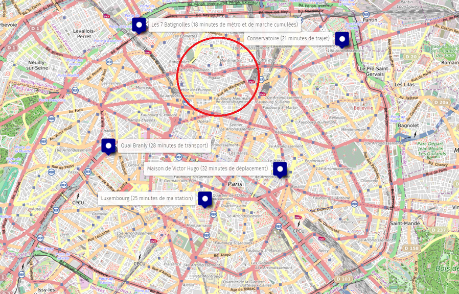
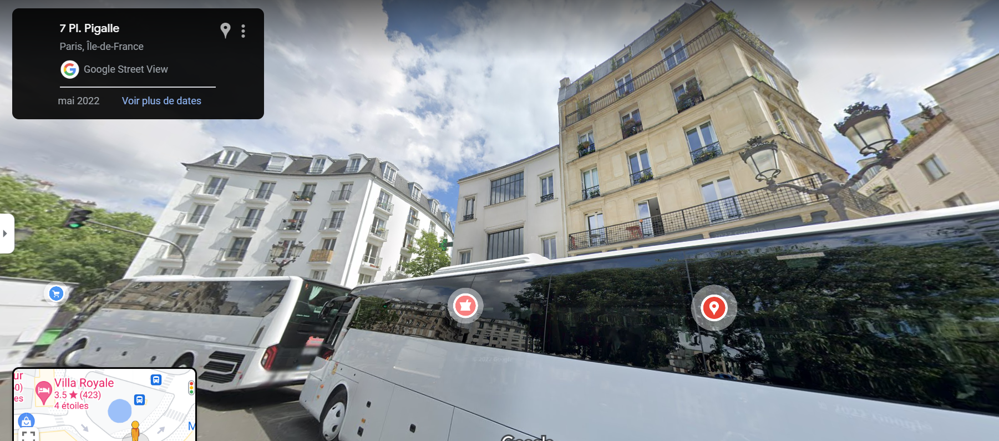

# Les OSINTables 2/3

**Catégorie** : Moyen | **Points** : 975 | **Solves** : 63

## Description

*Impressionée par votre déduction Cosette décide donc de s'ouvrir à vous, elle recherche désespérement l'adresse de Jean Valjean mais ne la trouve pas.*

*Elle dit ne connaître que quelques informations à son sujet :*

*- il habite Paris*

*- il est dans un des immeubles avec le plus d'étages à proximité de sa station de métro.*

*- il déteste les buveurs d'alcool.*

*- il aime être proche de son argent.*

*Elle vous donne également son adresse email: jean.valjean750075@gmail.com*

*Essayez de prendre contact avec lui pour trouver son adresse.*

## Solution

Pour résoudre ce challenge, je me rends sur le site [Epieos](https://epieos.com/) afin d'obtenir plus d'informations sur cette adresse mail. J'ai ainsi accès à son [calendrier](https://calendar.google.com/calendar/u/0/embed?src=jean.valjean750075@gmail.com). On trouve très vite des évènements dans son agenda la semaine du 15 mai :

**- Passage au Conservatoire National Supérieur de Musique et de Danse de Paris (21 minutes de trajet)**
**- Visite du Musée du Quai Branly (28 minutes de transports)**
**- Lecture au Jardin du Luxembourg (25 minutes de ma station)**
**- Repas chez Victor (32 minutes de déplacement)**
**- Film au Cinéma Les 7 Batignolles (18 minutes de métro et de marche cumulées)**

A partir des informations récupérées dans le calendrier je peux maintenant estimer une zone potentielle pour trouver son adresse :

<p align="center">
  
</p>

Après avoir testé plusieurs stations de métro, je trouve finalement la bonne : Pigalle. En effet, les temps de trajet concorde (avec une légère erreur pour plusieurs d'entre eux mais c'est la station qui concorde le plus avec des temps de trajet).

Je me rends maintenant sur Google Maps et j'essaye de trouver un immeuble avec beaucoup d'étages. Après plusieurs essais infructueux, je trouve enfin le bon immeuble :

<p align="center">
  
</p>

## Flag

<details>
<summary>🚩</summary>

```
404CTF{7_place_pigalle}
```