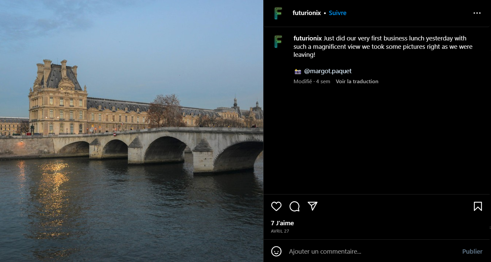
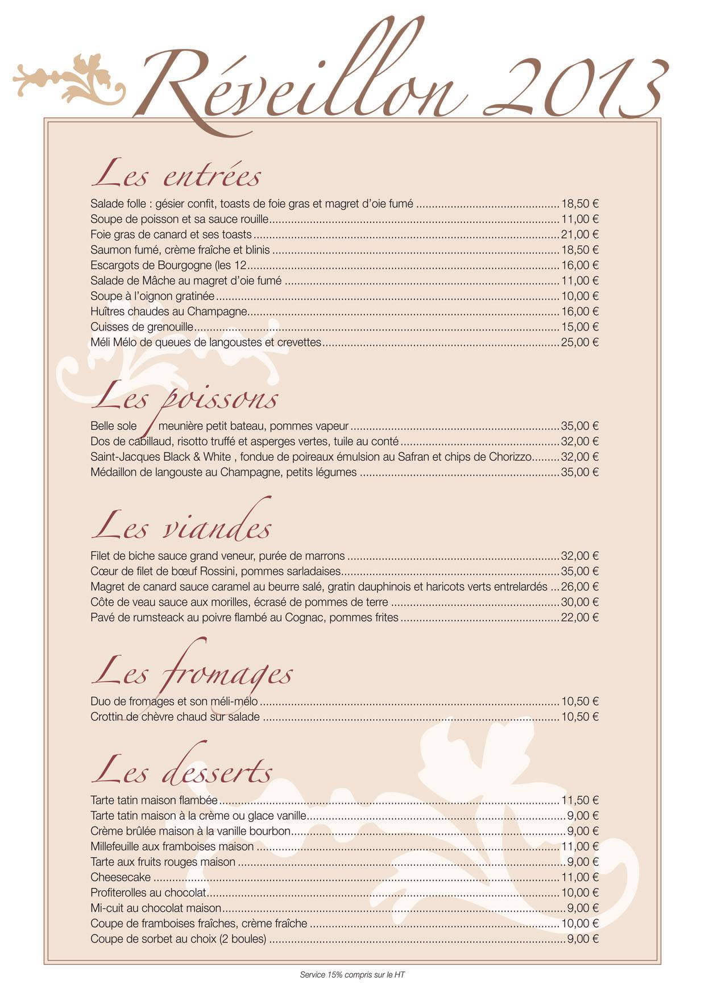

# Mentions gastronomiques

**Catégorie** : Facile | **Points** : 850 | **Solves** : 153

## Description

*Vous entendez de l'agitation dans le café, la commissaire Anne Capestan ainsi que sa brigade des Poulets Grillés sont sur une enquête traitant d’emplois fictifs et il est nécessaire de retracer les pas des grands acteurs de cette arnaque. La brigade, qui a pourtant la réputation d'être d'une efficacité redoutable malgré les personalités fortes qui la compose, n'arrive pas à avancer dans l'enquête. Vous êtes conviés à apporter un regard nouveau à ce qui semble être une chasse à l'homme ou plutôt une chasse à la femme dans ce cas précis... La principale suspecte se prénommerait Margot Paquet, si ce n'est pas un pseudonyme... Nous savons qu’elle est allée au restaurant peu de temps avant de totalement disparaître, trouvez le nom du restaurant et le prix qu’elle y a payé pour aider l'enquête à avancer. Anne a besoin de vous, elle doit redorer son blason après sa sanction pour utilisation d'armes abusive, faites au mieux !*

*Trouvez le nom du restaurant et le prix qu’elle y a payé.*

## Solution

Première chose à faire pour ce chall : rechercher le nom de Margot Paquet sur internet. Dans les premiers résultats on trouve rapidement un [compte Instagram](https://www.instagram.com/margot.paquet/) (il est peut-être dans les premiers résultats mais cela ne l'a pas toujours été, alors on peut simplement faire une dork Google en tapant "Margot Paquet", et même si cela ne marche pas on peut toujours tenter de trouver son compte sur plusieurs réseaux sociaux, typique de l'OSINT).

On identifie rapidement le bon compte (des photos libres de droit un peu aléatoires) et en allant dans la rubrique "Identifié(e)", on voit qu'elle a été mentionné dans un [post](https://www.instagram.com/p/Crdhah0Nlie/) par un autre [compte](https://www.instagram.com/futurionix/).

En allant sur ce nouveau compte on trouve une publication plus qu'intéressante.

<p align="center">
  
</p>

On sait maintenant qu'il faut trouver le restaurant en face du bâtiment de la photo. Avec une simple recherche inversée, on trouve immédiatement le lieu : le pont Royal. En se balandant sur Google Maps, coup de chance : il n'y a qu'un seul restaurant dans le coin. On trouve donc le restaurant **La Frégate**.

Maintenant, la partie la plus difficile du challenge, à savoir trouver le prix qu'elle a payé. Tout d'abord la publication qui parle du déjeuner date du 27 avril. On va donc sur le compte de Margot Paquet et on regarde ce qu'elle a consommé le 27 avril : des cuisses de grenouille et une tarte tatin. Il faut maintenant trouver le menu du restaurant, ce qui a été la partie la plus difficile du challenge.

Après beaucoup de recherches et de dorks Google, je tombe finalement sur le site [Pages jaunes](https://www.pagesjaunes.fr/pros/05383453). De là, je me rend dans la rubrique contact, depuis laquelle je trouve le [compte Facebook](https://www.facebook.com/profile.php?id=100063678665296&sk=photos) du restaurant. Et coup de bol, ils ont publié leur [menu](https://www.facebook.com/25012865039/photos/pb.100063678665296.-2207520000./10152096781360040/?type=3) (datant de 2013 certes, mais les prix n'ont pas dû changer depuis j'imagine).


<p align="center">
  
</p>

Il ne reste qu'à faire le calcul : les cuisses de grenouille à 15€ et la tarte tatin à 11€50, soit un total de 26€50.

## Flag

<details>
<summary>🚩</summary>

```
404CTF{la_fregate_26.50}
```