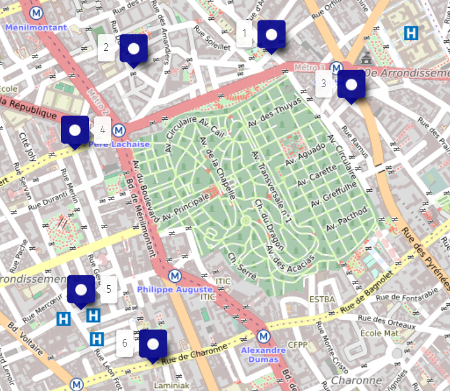
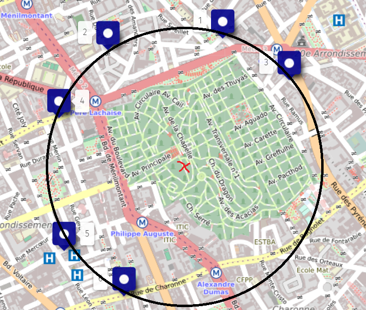
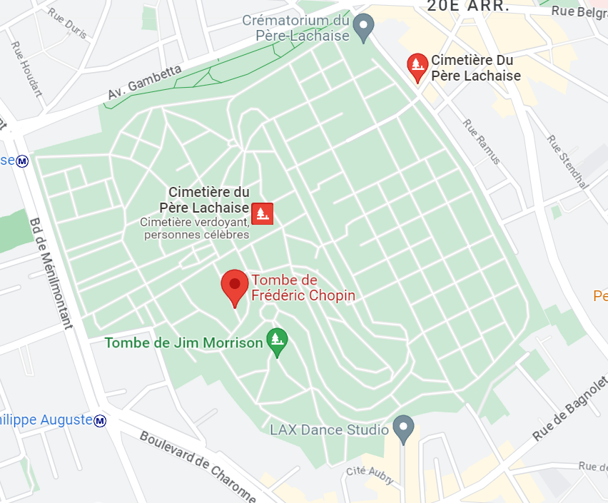

# Un vol ?

**Catégorie** : Facile | **Points** : 818 | **Solves** : 168

## Description

*Vous êtes tranquillement assis dans le café litteraire, quand quelqu'un s'approche de vous et commence à vous parler :*

*« Connaissez vous l'histoire d'Arsène Lupin ? Non ? Et bien remédions à cela. Arsène Lupin est un gentleman cambrioleur. Il est très doué dans son domaine, en particulier dans l'art du déguisement et de l'usurpation d'identité. C'est grâce à ses nombreux talents qu'il a réussis certains des plus grands casses n'ayant jamais vu le jour : il a notamment récupéré la dalle des rois de Bohême ou encore escroqué le crédit lyonnais. Cependant, un mystère demeure : **où cache-t-il ses butins ?***

*Sachez que récemment, Arsène Lupin a été aperçu et pris en filature... Je n'ai malheureusement pas le temps de me pencher sur cette affaire, mais peut-être que vous, vous pourrez trouver le lieu où il cache ses trésors. »*

## Solution

Il nous est donné 6 photos pour ce challenge. Après les avoir regardé rapidement, j'ai eu l'idée de placer les différents points des lieux qu'Arsène Lupin a pu visiter sur une carte :

<p align="center">
  
</p>

Je me suis alors rendu compte que cela formait un cercle. J'ai donc relié les points et identifié le centre du cercle :

<p align="center">
  
</p>


J'ai ensuite identifié le lieu à l'aide de Google Maps :

<p align="center">
  
</p>

## Flag

<details>
<summary>🚩</summary>

```
404CTF{tombe_de_frederic_chopin}
```