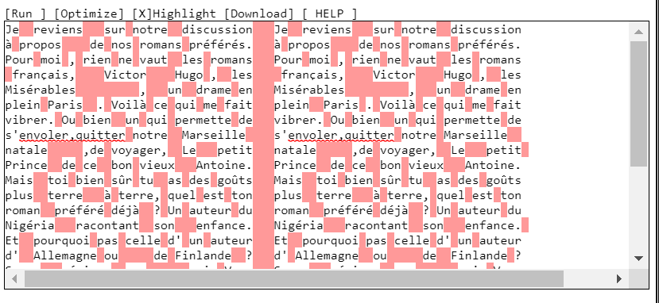

# En Profondeur

**Catégorie** : Moyen | **Points** : 961 | **Solves** : 78

## Description

*Alors que vous dégustiez une assiette d'oeufs mayo, un homme fait son apparition dans Le Procope. Il prend place à côté de vous et se présente comme étant Monsieur de Valmont. Il vous raconte avoir reçu une lettre étonnante de Madame de Merteuil. Après quelques temps passé à discuter, il vous confie que celle-ci avait accepté un rendez-vous avec lui suite à un pari gagné. Il doutait franchement qu'elle honore sa parole, d'autant qu'elle voyage beaucoup et qu'il n'a pas le permis b lui permettant de la rejoindre n'importe où. Il s'interroge néanmoins sur cette lettre. Pouvez-vous aider de Valmont à voir le message caché derrière celle-ci ?*

## Solution

A première vue, on ne discerne pas vraiment ce qu'il faut faire pour ce challenge. Cependant, j'ai remarqué que les espaces ne concordaient pas parfaitement dans les deux textes. Je les ai donc visualisé avec un [outil](https://vii5ard.github.io/whitespace/) en ligne pour surligner les espaces :

<p align="center">
  
</p>

On peut remarquer que le pattern n'est pas similaire pour certains mots dans les deux blocs de texte, notamment : Paris, Marseille, Allemagne... J'ai donc relevé les mots qui avaient le même pattern dans le bloc de gauche (un espace à gauche du mot et deux après).

## Vraie solution

Après avoir discutés avec le créateur du challenge, il s'avère que la méthode qu'il fallait utiliser pour résoudre ce challenge est bien plus ingénieuse que ce que l'on croit. En effet, il a utilisé le principe des [autostéréogrammes](https://fr.wikipedia.org/wiki/Autost%C3%A9r%C3%A9ogramme), qui consite à voir une représentation en 3D d'une image 2D en modifiant son regard (au lieu de regarder l'image directement, il faut regarder au loin et déflouter sa vision jusqu'à voir l'image en 3D).
Il y en a également qui sont constitués de deux images et il faut essayer de loucher pour voir la troisième image au milieu des deux autres (ce que je n'arrive toujours pas à faire).
Le créateur du challenge a donc utilisé ce principe appliqué au texte (stéréogramme ASCII) et le but était de visualiser un troisième bloc de texte au milieu des autres, sur lequel ressortait ainsi des mots (formant le flag).

## Flag

<details>
<summary>🚩</summary>

```
404CTF{paris_finlande_15_6_avion}
```