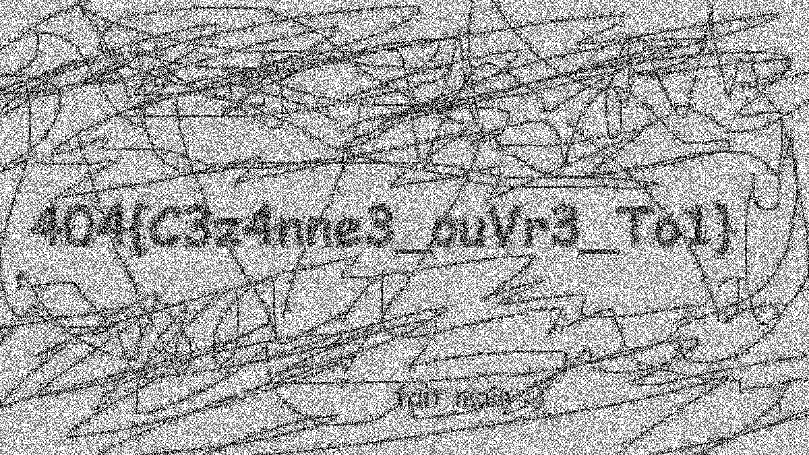

# L'Œuvre

**Catégorie** : Facile | **Points** : 200 | **Solves** : 783

## Description

*Dans un coin du Procope, vous remarquez Claude Lantier scrutant sans relâche un tableau, tasse à la main. Cette situation vous interpelle et vous lui demandez ses raisons. Il vous explique qu'avec son œil de peintre il remarque des **variations de couleurs** à la limite de l'imperceptible.*

*Trouvez un message secret dans la peinture ci-jointe.*

<p align="center">
  
</p>

## Solution

Pour résoudre ce challenge, j'ai simplement ouvert l'image dans [Stegsolve](https://wiki.bi0s.in/steganography/stegsolve/#installation) et obtenu le résultat suivant :

<p align="center">
  
</p>

## Flag

<details>
<summary>🚩</summary>

```
404CTF{C3z4nne3_ouVr3_To1}
```